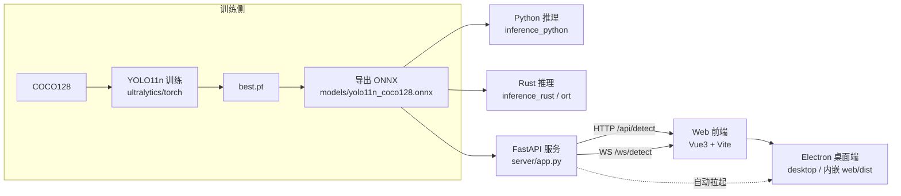

# YOLO 实时目标检测：训练 → 多语言推理 → 应用接入

一个从零跑通的目标检测工程实践：用 **Ultralytics YOLO11n** 在 COCO128 上完成训练，
导出 **ONNX** 后分别用 **Python** 与 **Rust** 实现实时推理，
再通过 **FastAPI + WebSocket** 把能力接入 **Web（Vue3）** 与 **桌面端（Electron）** 应用。

> 本文重点记录**项目思路与工程决策**；具体的代码实现细节请直接阅读各模块源码。

---

## 一、项目目标

对应"二、yolo 的跑通"三部分要求：

| 序号 | 要求 | 本项目的落地方式 |
| --- | --- | --- |
| 1 | 完成一次 Ultralytics 训练 | COCO128 + YOLO11n，纯 CPU 训练 30 epochs，产出 `best.pt` 与 mAP 指标 |
| 2 | 实时推理部署（Python 快速版 → C++/Rust 优化） | Python 版基于 `ultralytics` 快速跑通；Rust 版基于开源库 `ort`（ONNX Runtime）+ `image` 做原生加速，与 Python 版对照 |
| 3 | 接入应用（Web + 桌面内嵌） | FastAPI 提供 HTTP/WebSocket 推理服务；Web 用 Vue3 + Vite，桌面用 Electron 内嵌同一前端 |

**贯穿始终的一条主线**：*先跑通、再优化、最后接入应用*。每一步都基于成熟开源库，不重复造轮子。

---

## 二、成果速览

| 环节 | 关键结果 |
| --- | --- |
| 训练 | COCO128 / YOLO11n / 30 epochs / CPU，**mAP50 = 0.7111，mAP50-95 = 0.5529** |
| 模型导出 | ONNX（opset 12, imgsz 416, simplify），大小约 10.2 MB，输入 `[1,3,416,416]`，输出 `[1,84,3549]` |
| Python 推理 | 基于 `ultralytics` + `cv2`，视频流平均 **≈ 41 FPS** |
| Rust 推理 | 基于 `ort` + `image`，release 模式基准 **≈ 61.7 FPS**（pre 7.1ms / infer 8.8ms / post 0.3ms） |
| 后端服务 | FastAPI，`/api/detect` 热态单帧 ≈ 15ms，WebSocket 单帧 ≈ 12ms |
| Web / 桌面 | 摄像头实时画框，Electron 内嵌前端并可自动拉起后端 |

> 全部在 **无 CUDA、纯 CPU**（Intel i7-13650HX，Intel 核显）环境下完成。

---

## 三、技术选型与思路（重点）

### 3.1 总体思路：一条"可复现、可对比、可落地"的链路

```
训练(torch/ultralytics) → 导出(ONNX 中间格式) → 推理(Python 验证) → 推理(Rust 优化) → 服务化(FastAPI) → 应用(Web/桌面)
```

核心判断有三点：

1. **ONNX 作为"中间语言"**：训练用 PyTorch，但推理要跨语言（Python / Rust / 浏览器）。ONNX 是这条链路上唯一被所有运行时广泛支持的格式，因此把"训练框架"和"推理框架"解耦。
2. **Python 先验证、Rust 再优化**：先用最少代码验证"模型导出是否正确、后处理逻辑是否对齐"，确认正确性后再做性能优化。避免一上来就用 Rust 写一坨难调试的代码。
3. **服务化而不是各端各写一套推理**：把推理集中在 FastAPI 服务里，Web 和桌面端只负责"采集画面 + 画框"。这样模型只加载一次、逻辑只维护一份。

### 3.2 为什么选 COCO128 + YOLO11n

- **数据集**：COCO128 只有 128 张图，是 COCO 官方给的"冒烟测试集"。它足够小，能保证纯 CPU 上几分钟内完成一次完整训练；同时又覆盖 80 类真实场景，结果有说服力。作业目标是"跑通"，不是"刷榜"，选它性价比最高。
- **模型**：YOLO11n 是 Ultralytics 最新的 nano 级模型，参数量最小、CPU 推理最快，适合作为端到端演示的基线。
- **训练参数**：`imgsz=416`（比默认 640 更省算力，且与后续 ONNX 推理尺寸对齐）、`batch=16`、`epochs=30`、`cache=True`（小数据集全量缓存到内存）。这些都是为"CPU 可跑 + 结果可用"服务的折中。

### 3.3 为什么把模型导出成 ONNX

- **跨语言**：Rust（`ort`）、Python（`onnxruntime`）、后端都直接吃 ONNX，无需各自带一套 PyTorch。
- **性能**：ONNX Runtime 的图优化 + 算子融合在 CPU 上通常比直接跑 PyTorch 更快，也更适合部署。
- **固定尺寸 + 简化**：导出时 `dynamic=False` 固定 `416×416`、`simplify=True` 去掉冗余算子，让推理路径最短。

### 3.4 为什么"Python 快速版 + Rust 优化版"两套推理

这是作业明确要求，也是合理的工程节奏：

- **Python 版**（`inference_python/realtime.py`）：直接用 `ultralytics` 的 `predict()`，几十行就能跑摄像头/视频/图片，用来**验证模型与后处理正确性**。
- **Rust 版**（`inference_rust/`）：参考开源库而不是自研。选型如下——

| 关注点 | 选择 | 理由 |
| --- | --- | --- |
| 推理引擎 | `ort`（ONNX Runtime 官方 Rust 绑定） | 官方维护、性能与 C++ 版一致，避免自己写算子 |
| 图像读写/缩放 | `image` | Rust 生态最成熟的图像库 |
| 画框/画字 | `imageproc` + `ab_glyph` | 与 `image` 无缝配合，无需引入 OpenCV |
| 摄像头采集 | `nokhwa` | 跨平台摄像头库，作为可选 feature |
| CLI 参数 | `clap`（derive） | 标准做法，零手写解析 |

Rust 版刻意做到：**letterbox 预处理 → 模型推理 → 解码/YOLO 后处理 → NMS → 画框** 全流程与 Python 版对齐，从而让"加速比"是可对比、可解释的。

### 3.5 为什么 Web 用 Vue3、桌面用 Electron

- **Web**：Vue3 + Vite 上手快、构建产物小；核心业务就是"用 `getUserMedia` 抓帧 → 通过 WebSocket 发二进制 JPEG → 收到框后画到 canvas"，属于典型的轻量交互，不需要重框架。
- **实时通信选 WebSocket 而不是 HTTP**：视频流是持续的高频小包，HTTP 每帧都建连握手开销太大；WebSocket 长连接 + 二进制帧最合适。
- **桌面选 Electron**：前端已经写好了，Electron 能**零改动复用**同一份 `web/dist`，再用 Node 的 `child_process` 顺便把 Python 后端也拉起来，做到"双击即用"。这比 Tauri 在此场景下更省事（不需要处理 Rust ↔ 前端的额外集成）。

---

## 四、系统架构



**推理服务接口**

- `GET  /api/health`：健康检查（Electron 用它判断后端是否就绪）
- `POST /api/detect`：上传单张图片 → JSON 检测结果
- `WS   /ws/detect`：持续推送 JPEG 帧 → 逐帧返回 JSON 检测结果

---

## 五、目录结构

```
yolo/
├─ training/             # 训练与导出
│  ├─ train.py           #   COCO128 上训练 YOLO11n
│  └─ export_onnx.py     #   导出 ONNX 到 models/
├─ inference_python/     # Python 快速推理（摄像头/视频/图片）
│  └─ realtime.py
├─ inference_rust/       # Rust 原生推理（ort + image）
│  ├─ Cargo.toml
│  └─ src/main.rs        #   image / dir / bench / camera 子命令
├─ server/               # FastAPI 推理服务（HTTP + WebSocket）
│  └─ app.py
├─ web/                  # Vue3 + Vite 前端（摄像头实时画框）
├─ desktop/              # Electron 桌面端（内嵌 web/dist）
├─ models/               # 导出的 ONNX（.gitignore，需自行生成）
├─ datasets/             # coco128.yaml（图片数据 .gitignore，可自动下载）
├─ runs/                 # 训练/推理输出（权重与演示帧 .gitignore）
└─ ENGINEERING_LOG.md    # 工程日志
```

---

## 六、快速开始

> 建议在仓库根目录执行 Python 相关命令（脚本内部按 `__file__` 定位根目录，但为与 `coco128.yaml` 保持一致仍推荐如此）。

### 0. 环境准备

```powershell
python -m venv .venv
.\.venv\Scripts\Activate.ps1
pip install ultralytics onnx onnxruntime opencv-python fastapi "uvicorn[standard]" python-multipart
```

Rust 侧需要 stable 工具链（本项目在 `stable-x86_64-pc-windows-gnu` 上验证）。

### 1. 训练

```powershell
python training/train.py
# 自定义：python training/train.py --model yolov8n.pt --epochs 30 --imgsz 416
```

产物：`runs/train/coco128_yolo11n/weights/best.pt`，以及 `results.csv` / 曲线图。

### 2. 导出 ONNX

```powershell
python training/export_onnx.py --weights runs/train/coco128_yolo11n/weights/best.pt
```

产物：`models/yolo11n_coco128.onnx`。

### 3. Python 实时推理

```powershell
python inference_python/realtime.py --source 0                       # 摄像头
python inference_python/realtime.py --source demo.mp4                # 视频
python inference_python/realtime.py --source img.jpg --engine onnx    # 用 ONNX 推理
```

### 4. Rust 原生推理

```powershell
cd inference_rust
cargo build --release
# 让 ort 在运行时动态加载 onnxruntime（指向 venv 里的 dll）
$env:ORT_DYLIB_PATH = "..\.venv\Lib\site-packages\onnxruntime\capi\onnxruntime.dll"

.\target\release\yolo-infer.exe image ..\runs\detect\demo_clip.mp4
.\target\release\yolo-infer.exe bench ..\datasets\coco128\images\train2017 --rounds 5 --limit 40
```

> 注意：`--out` 是**全局参数**，需写在子命令之前，例如
> `yolo-infer.exe --out runs\detect\rust image ..\x.jpg`。

### 5. 启动推理服务

```powershell
python -m uvicorn server.app:app --host 127.0.0.1 --port 8000
# 健康检查：curl http://127.0.0.1:8000/api/health
```

### 6. Web 前端

```powershell
cd web
npm install
npm run dev      # http://127.0.0.1:5173
npm run build    # 产出 web/dist，供桌面端加载
```

### 7. 桌面端（Electron）

```powershell
cd desktop
npm install
npm start        # 生产模式：加载 ../web/dist，并自动拉起 Python 后端
npm run dev      # 开发模式：连接 Vite 开发服务器
```

---

## 七、各环节实现要点（思路层面）

- **训练**：在 `import ultralytics` 之前把 `YOLO_CONFIG_DIR` 重定向到工作区内，避免框架把配置/字体写进用户目录；小数据集开启 `cache=True`；训练结束再跑一次 `model.val()` 打印 mAP。
- **导出**：`opset=12 + imgsz=416 + simplify=True + dynamic=False`，并统一复制到 `models/` 便于其他模块引用。
- **Python 推理**：统一用 `model.predict(stream=...)` 处理摄像头/视频流，滑动平均估算 FPS；同一份代码可切 `--engine pt|onnx`。
- **Rust 推理**：手写 letterbox 预处理 → `ort` 推理 → 解码（YOLOv8/11 无 objectness，取 80 类最大分）→ 类别内 NMS → `imageproc` 画框；`ort` 会话复用，避免每帧重复加载模型。
- **后端**：模型在 `startup` 时加载一次；推理是 CPU 密集操作，用 `asyncio.to_thread` 放到线程池，避免阻塞事件循环；开启 CORS 方便前端开发。
- **前端**：`getUserMedia(640×480)` 抓帧 → `canvas.toBlob` 压成 JPEG(0.7) → WebSocket 发送 ArrayBuffer；收到结果按 `object-fit: contain` 的比例换算坐标再画框。
- **桌面端**：启动时先 `healthCheck()`，后端没起来才 `spawn` uvicorn，并轮询等待就绪；生产环境用 `loadFile(web/dist/index.html)`（Vite `base:'./'` 保证 `file://` 下资源可加载）；退出时 kill 后端子进程。

---

## 八、已知限制与后续优化

- **训练规模小**：COCO128 仅用于跑通流程，真实业务需换更大数据集并做数据增强调参。
- **纯 CPU 推理**：如需更高吞吐可换 TensorRT / OpenVINO / DirectML，或启用 INT8 量化。
- **Rust 关键路径已优化**（LTO、`codegen-units=1`、`opt-level=3`），但摄像头采集目前仍靠 `nokhwa`，跨平台兼容性可再打磨。
- **服务端并发**：当前单模型串行推理，高并发场景可考虑多实例/批处理。

---

## 九、工程日志

完整的工程过程、决策记录与踩坑复盘见 **[ENGINEERING_LOG.md](./ENGINEERING_LOG.md)**。

---

## 十、参考

- [Ultralytics YOLO 官方文档](https://docs.ultralytics.com/)
- [ONNX Runtime](https://onnxruntime.ai/) 与 [`ort` crate](https://ort.pyke.io/)
- 训练流程参考：<https://blog.csdn.net/linmoqian/article/details/157656782>
